# CopilotHarness

> **Turn a text specification into a working application — autonomously.**

CopilotHarness transforms the **GitHub Copilot CLI** from a coding assistant into an autonomous software engineer. It wraps the CLI in a persistent loop that plans, implements, verifies, and iterates until your application is complete.

---

## What It Does

Building complex apps with AI often fails because agents "forget" context or skip steps. CopilotHarness solves this by providing **memory** and **structure**.

It takes a plain English description of an app (`app_spec.txt`) and:
1.  **Plans**: Breaks the spec into a detailed checklist of testable features.
2.  **Builds**: Implements features one by one, maintaining context across sessions.
3.  **Verifies**: Checks that each feature works before moving to the next.
4.  **Persists**: Saves progress so work can pause and resume without data loss.

---

## Why Use a Harness?

AI coding agents face a fundamental "Context Amnesia" problem.

| Without Harness | With CopilotHarness |
|-----------------|---------------------|
| **One-Shot Failure**: Tries to build everything at once and runs out of context. | **Incremental Success**: Builds one feature at a time, fully tested. |
| **Premature Completion**: Declares "Done!" when code is only half-written. | **Definition of Done**: Only stops when every item on the checklist passes. |
| **Context Loss**: Each session starts fresh, guessing what happened before. | **Perfect Memory**: Reads `progress.json` to pick up exactly where it left off. |
| **Untested Code**: Writes code that looks correct but doesn't run. | **Verified Code**: Mandates verification steps before marking tasks complete. |

---

## How It Works

The harness operates in a continuous loop: **Plan → Code → Verify → Repeat**.

```mermaid
flowchart LR
    Spec[📝 Your Spec] --> Init[⚙️ Initializer]
    Init --> Checklist[📋 Feature Checklist]
    
    subgraph Loop ["The Autonomous Loop"]
        direction TB
        Checklist --> Pick[👉 Pick Next Task]
        Pick --> Code[🤖 Copilot CLI Implements]
        Code --> Verify[✅ Verify & Test]
        Verify --> Update[📝 Update Progress]
        Update --> Checklist
    end
    
    Update -->|All Done?| App[📦 Finished App]
```



### The Workflow

1.  **Initialization**: The harness reads your `app_spec.txt`, **creates a dedicated GitHub repository and tracking issue**, and generates a `feature_list.json` containing 150+ test cases covering core features, UI, and edge cases.
2.  **Implementation**: It picks the highest-priority failing test.
3.  **Coding Session**: It spins up the Copilot CLI to write the code for that specific feature.
4.  **Verification**: It verifies the feature (using browser automation or checks) and marks it as "passing".
5.  **Iteration**: It repeats this process until 100% of the checklist is green.

**GitHub Integration**: The harness automatically creates a private GitHub repository and an Epic tracking issue during initialization. After each session, it updates the issue with progress, completed features, and next steps—providing a complete audit trail of the autonomous development process.

---

## Quickstart

### 1. Install Prerequisites

<details>
<summary><strong>📦 Install on macOS</strong></summary>

```bash
# Install Homebrew (if not installed)
/bin/bash -c "$(curl -fsSL https://raw.githubusercontent.com/Homebrew/install/HEAD/install.sh)"

# Install Node.js 22+ and Python 3.10+
brew install node python@3.12

# Install or Update GitHub Copilot CLI
# See: https://docs.github.com/en/copilot/how-tos/set-up/install-copilot-cli
brew install copilot-cli

or 

npm install -g @github/copilot

# Authenticate with GitHub (for git operations)
brew install gh
gh auth login

# Authenticate with Copilot CLI (opens browser)
copilot
# Then type: /login

# Install Playwright browsers (for UI verification)
npx playwright install chromium
```

</details>

<details>
<summary><strong>📦 Install on Windows</strong></summary>

**Requirements:** PowerShell v6+, Node.js 22+

```powershell
# Install Copilot CLI via WinGet
# See: https://docs.github.com/en/copilot/using-github-copilot/using-github-copilot-in-the-command-line
winget install GitHub.Copilot

# Install Node.js from https://nodejs.org (v22+)
# Install Python from https://python.org (v3.10+)

# Authenticate with GitHub (for git operations)
winget install GitHub.cli
gh auth login

# Authenticate with Copilot CLI
copilot
# Then type: /login

# Install Playwright browsers
npx playwright install chromium
```

</details>

<details>
<summary><strong>📦 Install on Linux</strong></summary>

```bash
# See: https://docs.github.com/en/copilot/using-github-copilot/using-github-copilot-in-the-command-line

# Option 1: Install via Homebrew
brew install copilot-cli

# Option 2: Install via npm (requires Node.js 22+)
npm install -g @github/copilot

# Option 3: Install via script
curl -fsSL https://gh.io/copilot-install | bash

# Install Python if not present
sudo apt install python3 python3-pip  # Debian/Ubuntu

# Authenticate with GitHub (for git operations)
# Install GitHub CLI: https://github.com/cli/cli#installation
gh auth login

# Authenticate with Copilot CLI
copilot
# Then type: /login

# Install Playwright browsers
npx playwright install chromium
```

</details>

<details>
<summary><strong>🔧 Configure Playwright MCP Server (Required)</strong></summary>

The harness uses Playwright MCP (Model Context Protocol) for browser automation. 

**Option 1: Check if you already have Playwright MCP configured**
```bash
# Check your existing Copilot CLI MCP config
cat ~/.copilot/mcp-config.json
# Look for "playwright" in the mcpServers section
```

**Option 2: Use the included config file**
```bash
# Copy the pre-configured MCP settings from this repo
mkdir -p ~/.copilot
cp .copilot/mcp-config.json ~/.copilot/mcp-config.json
```

The included config sets up: `playwright` (browser automation)

</details>

<details>
<summary><strong>⚡ Install Skills (Recommended)</strong></summary>

The harness includes reusable "skills" that improve agent behavior:

```bash
# Copy skills to your global Copilot config
mkdir -p ~/.copilot/skills
cp -r .copilot/skills/* ~/.copilot/skills/
cp .copilot/copilot-instructions.md ~/.copilot/copilot-instructions.md

# Verify installation
ls ~/.copilot/skills/
```

Skills include: `test-driven-development`, `systematic-debugging`, `verification-before-completion`, and more.

</details>

**Verify everything works:**
```bash
./check_prerequisites.sh
```

### 2. Define Your App

Edit `prompts/app_spec.txt` to describe what you want to build:

```xml
<project_specification>
  <project_name>My Awesome App</project_name>
  <overview>A task manager with drag-and-drop interface.</overview>
  <technology_stack>
    <frontend>React + Tailwind</frontend>
    <backend>Node.js</backend>
  </technology_stack>
</project_specification>
```

Or include `prompts/app_spec.txt` as context file together with a copilot prompt as a template for an application you want to create.

### 3. Run the Harness

```bash
# Run with external monitor window (recommended)
python autonomous_agent_demo.py --project-dir my_app --external-monitor &

# Or run in foreground for debugging
python autonomous_agent_demo.py --project-dir my_app
```

### 4. Watch It Build

The harness creates a `my_app` directory in `$HOME/Projects/`:
```
my_app/
├── app/           # Deployable application code
└── .harness/      # Logs, progress tracking, specs
```

Monitor progress in real-time:
```bash
./monitor_agent.sh --project my_app
```

The harness will also initialise git, upload to github and create an issue and update it as it progresses.
---

## Detailed Architecture

CopilotHarness orchestrates several components to maintain stability and security.

```mermaid
flowchart TB
    subgraph Harness["🤖 CopilotHarness"]
        Demo["Entry Point<br/>(autonomous_agent_demo.py)"]
        Agent["Loop Controller<br/>(agent.py)"]
        Client["CLI Bridge<br/>(copilot_client.py)"]
        Security["Security Filter<br/>(security.py)"]
        
        Demo --> Agent
        Agent --> Client
        Client --> Security
    end
    
    subgraph External["System"]
        Copilot["GitHub Copilot CLI"]
        Browser["Playwright Browser"]
    end
    
    Client <-->|Subprocess| Copilot
    Copilot -->|MCP| Browser
```



### Key Components

*   **Loop Controller (`agent.py`)**: The brain. It manages the session lifecycle, handles errors, and triggers "Recovery Mode" if the agent gets stuck.
*   **CLI Bridge (`copilot_client.py`)**: Manages the subprocess connection to GitHub Copilot CLI, streaming output and capturing tool calls.
*   **Security Filter (`security.py`)**: An allowlist that blocks dangerous shell commands (like `rm` or `curl`) to ensure the agent plays safely.
*   **Progress Monitor (`monitor.py`)**: Parses real-time output to update the `progress.json` tracker and generate readable logs.

### The "Test" System
Unlike traditional CI/CD, the harness uses a **checklist-driven** testing approach:
1.  **`feature_list.json`**: A JSON file of "test cases" generated by the AI from your spec.
2.  **Verification**: The agent must actively verify a feature works (e.g., by checking the UI) before it is allowed to flip the status from `"passes": false` to `"passes": true`.
3.  **Completion**: The project is considered complete only when `count_passing_tests()` returns 100%.

---

## Configuration Options

| Flag | Description | Default |
|------|-------------|---------|
| `--project-dir` | Where to build the app. Relative paths go to `$HOME/Projects/`. | `./autonomous_demo_project` |
| `--model` | The AI model to use (e.g., `claude-sonnet-4.5`, `gpt-5`). | `claude-sonnet-4.5` |
| `--max-iterations` | Stop after N sessions (useful for cost control). | Unlimited |
| `--external-monitor` | Opens a separate terminal window for clean monitoring. | `False` |

---

## Security

The agent runs in a sandbox with an **allowlist** of safe commands. Allowed: `ls`, `cat`, `npm`, `node`, `git`, `mkdir`, etc. **Blocked**: `rm`, `curl`, `wget`, `sudo`, and anything not explicitly permitted. See [security.py](security.py) for the full list.

---

## Troubleshooting

**Harness won't start?**
Run `./check_prerequisites.sh` to verify your environment.

**Progress stuck at 0%?**
The first session is the **Initializer**. It spends time generating the project structure and the 200+ item feature list. Actual code changes appear in Session 2.

**Running from VS Code?**
Always background the process with `&` (as shown in Quickstart). Otherwise, other Copilot Chat commands may interrupt the harness.

**Want to restart?**
Simply delete the project folder and run the command again.
```bash
rm -rf $HOME/Projects/my_app
python autonomous_agent_demo.py --project-dir my_app
```

---

## License
MIT License. See `LICENSE` for details.
