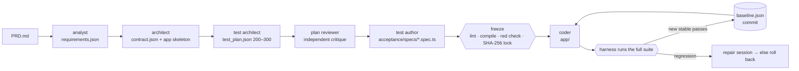

# Architecture: copilot-harness v2

A test-driven development harness for GitHub Copilot. You give it a PRD. It produces a
frozen, executable acceptance suite of 200–300 tests, then drives Copilot agents until the
suite passes. Every passing test becomes part of a regression baseline that CI enforces.

**Core principle: no agent grades its own work.** Agents write requirements, tests and
code. The harness validates, runs, records, commits and gates.

## Pipeline



| Phase | Agent role | Harness checks before moving on |
|---|---|---|
| requirements | analyst | JSON schema; unique IDs; measurable thresholds for performance; append-only for changes |
| architecture | architect | contract and app-contract schemas; **smoke test**: app installs, builds, starts on a random port, and answers health and reset hooks |
| plan | test architect | 200–300 tests; ≥55% functional; minimums for security/performance/usability; every requirement covered; P0 needs a negative test; performance tests carry thresholds; groups ≤ 30 |
| review | plan reviewer (separate session) | high/medium findings → one revision round, re-validated |
| approval | human (optional `--pause-after-plan`) | `copilot-harness approve` |
| authoring | test author | static lint (IDs, assertions, no skip/only/sleep/random, no tautologies); `playwright --list`; `tsc --noEmit` |
| freeze | — | **red check**: new tests run against the skeleton. Failures that look like test bugs (TypeError…) go back to the author. Tests that already pass get a **vacuity review**. Then lock + commit |
| implement | coder | **stop hook**: the agent can't stop while targets fail. Full suite after each session. Stability repeats before promotion. Regressions get repair-or-rollback |

Phases are derived from committed artifacts, so `copilot-harness run` is resumable at any point.

## Determinism

Tests are generated by an LLM, but once frozen they behave like hand-written tests:

1. **Executable, not prose.** Playwright specs with stable IDs in their titles
   (`FUNC-001: …`), parsed from machine-readable reports.
2. **Contract-first.** Routes, endpoints, accessible names, messages and test ids are
   fixed before any test or code exists, so tests don't guess selectors.
3. **Vetted measurement kit** (`acceptance/support`). Tests stay thin and consistent:
   latency percentiles after warm-up, Web Vitals medians, axe-core, security headers,
   cookie flags, injection payloads, and per-test unique data. `PERF_BUDGET_MULTIPLIER`
   scales budgets on slower CI hardware without editing tests.
4. **Runner settings.** `retries: 0`, one worker, fixed locale/timezone/viewport/colour
   scheme/reduced motion, an app state reset before every test (a same-origin hook, checked
   before each call), and a fresh app instance per run on a random port. Tests reach only the
   app: the config routes every other host, in the browser and in API requests, to a closed
   port.
5. **Static lint** rejects fixed sleeps, randomness, skips, focused tests, missing
   assertions, tautologies, absolute request URLs and imports from anything but the kit.
6. **Red check and vacuity review** catch tests that can't fail.
7. **Stability gate.** A newly passing test must pass `stability_repeats` (default 3)
   consecutive runs before it joins the baseline. A nightly CI job re-runs everything 3×.
8. **Freeze.** A SHA-256 lock covers specs, kit, Playwright config, dependency lockfile,
   requirements, contract, plan, PRD and CI workflows.

## Integrity: agents can't weaken the tests

| Layer | Mechanism |
|---|---|
| Tool permissions (SDK) | `on_permission_request` checks each write path against the role's scope. The coder may write only `app/**`, `harness/app-contract.json` and dispute claims. |
| Shell (SDK) | Uses the CLI's parsed command model: identifiers, `read_only`, `possible_paths`, `possible_urls`. Git is read-only. `gh`, `sudo`, `ssh`, `docker`, cloud CLIs and publishing are denied. Network is localhost plus docs/registries. Credential stores are unreadable. |
| Session hermeticity | No config discovery, custom instructions, file hooks or memory, so an agent can't plant config for a later session. |
| After every session | `git status`: changes outside the role's scope are reverted (tracked) or quarantined (untracked). Lock drift is restored from the last green commit. |
| Disputes | A test that is genuinely wrong is disputed (`.harness/disputes/claims/ID.json`). A separate adjudicator session decides, defaulting to uphold. An amendment changes only that test and is recorded in the lock. |
| CI | `gate.mjs` re-verifies the lock and requires `harness/baseline.json`. With `--base-ref` (the PR base, or the previous commit on push) it also refuses: removed baseline or planned tests; edited plan or requirement entries; retiring a test none of whose requirements were superseded; removed contract entries; PRD rewrites; spec changes without a recorded amendment; and kit/config/CI changes without a `relock` authorization. A base ref that can't be resolved fails the gate. |
| Paths | Write targets are resolved through symlinks before scope checks. Symlinks are not allowed in frozen paths: the lock and the gate list them without following them, and both reject them. MCP browser tools may only open localhost and allow-listed hosts. The Playwright MCP server is also started with `--allowed-origins` set to localhost. |

This is defence in depth, not a sandbox. Run the harness in a container or VM. The Copilot
CLI's experimental `sandbox` gives OS-level isolation where your platform supports it.

## Regression suite & feature changes

```bash
copilot-harness feature my_app --prd-delta add-comments.md
copilot-harness run my_app
```

The change goes through the same pipeline in **append-only** mode:
- requirements: existing entries are immutable; new ones get `origin: CHG-00N`; changed behaviour marks the old requirement `superseded`;
- contract: existing endpoints, routes and test ids must remain;
- plan: existing tests are byte-for-byte unchanged; new tests go into **new** spec files; tests of superseded requirements become `retired`, which needs `--allow-retire`;
- freeze: previously frozen spec files must be untouched; new tests must fail first (red check);
- implement: the **entire existing baseline** is the regression gate for every session.

## CI

Generated into each project (`.github/workflows/`):
- **acceptance.yml** (PR + push): install/build the app from `app-contract.json`, type-check
  the suite, run it, then `gate.mjs`. The gate fails on regressions, tampering, unplanned
  tests or load errors, plus the base-branch ratchet on PRs. Backlog tests that are planned
  but not yet implemented may fail.
- **acceptance.yml / dependency-audit** (`acceptance/scripts/audit.sh`): `npm audit` / `pnpm audit` for Node,
  `pip-audit` on `requirements.txt` or an exported `uv.lock` for Python, `govulncheck` for Go. Layouts it
  can't audit (Yarn, Poetry, unpinned dependencies) fail with instructions instead of passing.
- **acceptance-nightly.yml**: `--repeat-each=3` stability run.

Make `acceptance` a required check and put `acceptance/`, `harness/` and
`.github/workflows/` under CODEOWNERS.

## Agent backends

| | SDK (`github-copilot-sdk`, default) | CLI (`copilot -p`, fallback) |
|---|---|---|
| Permissions | per-request callback (role scopes, parsed shell) | `--deny-tool` rules + `--allow-url`; write scope enforced post-session |
| "Not done yet" | `on_agent_stop` → `{"decision": "block"}` | resume the session (`--resume <id>`) with remaining failures |
| Events/cost | typed events → JSONL; `total_nano_aiu` → credits | `--output-format json` + `--usage-output-file` |
| Limits | `session_limits.max_ai_credits`, timeout → `session.abort()` | `--max-ai-credits`, process-group kill |

## Files

```
copilot_harness/
  cli.py            commands: new run status verify feature approve report lint models doctor
  orchestrator.py   phases, sessions, scope enforcement, ratchet, disputes
  validators.py     requirements / contract / plan validation (feedback for agents)
  testlint.py       static checks for generated specs
  runner.py         prepare app, run Playwright/JUnit, smoke test
  results.py        Playwright JSON + JUnit → per-ID outcomes
  lock.py           SHA-256 freeze, drift detection, restore
  policy.py         permission decisions (pure, unit-tested)
  backends/         sdk.py (default), cli.py, fake.py (tests)
  prompts/          one prompt per role + shared rules
  templates/        acceptance kit, CI workflows, project files
```
